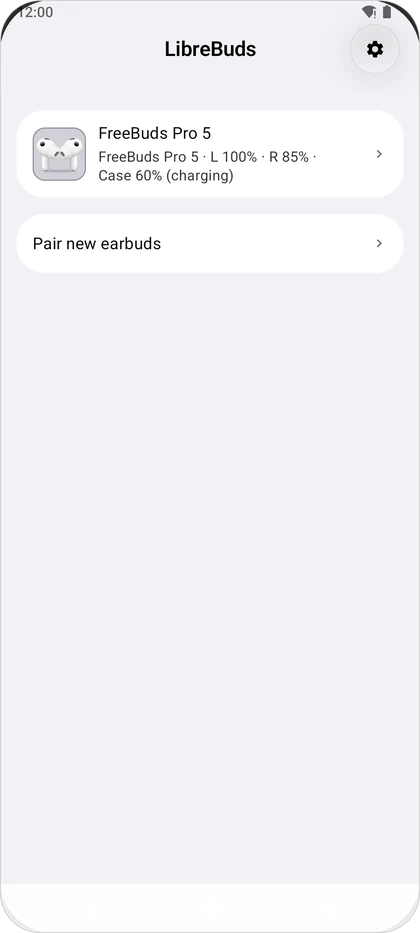
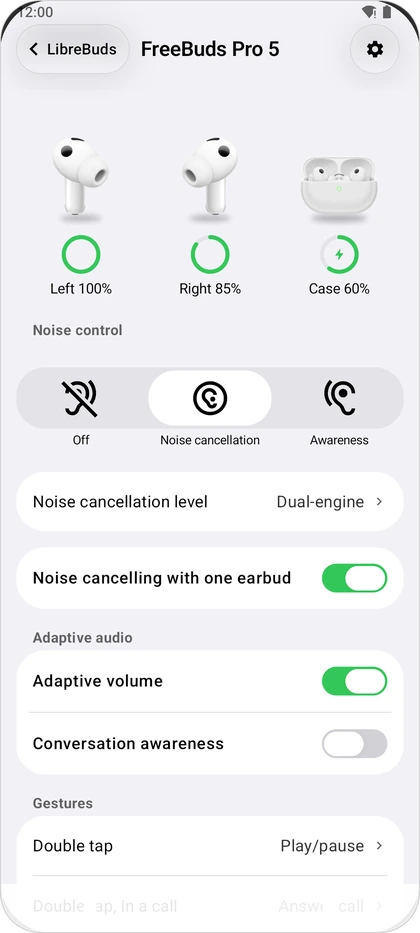
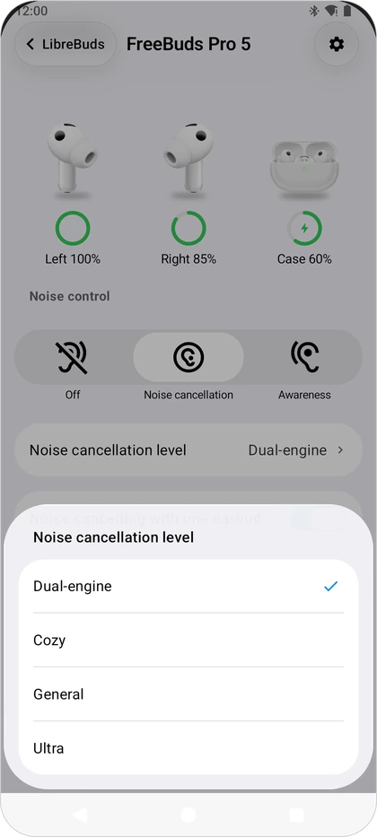
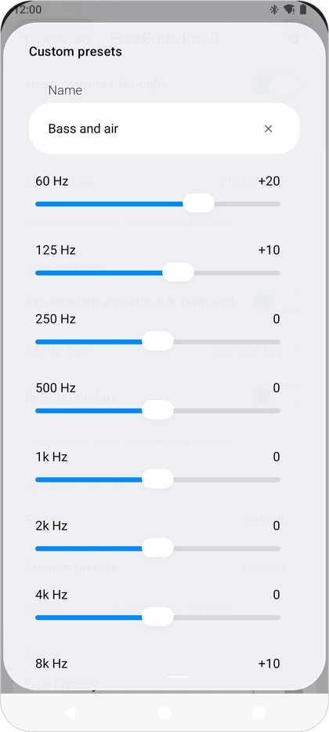
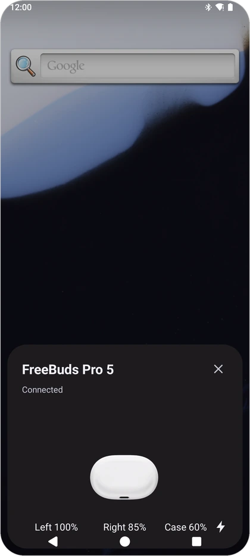
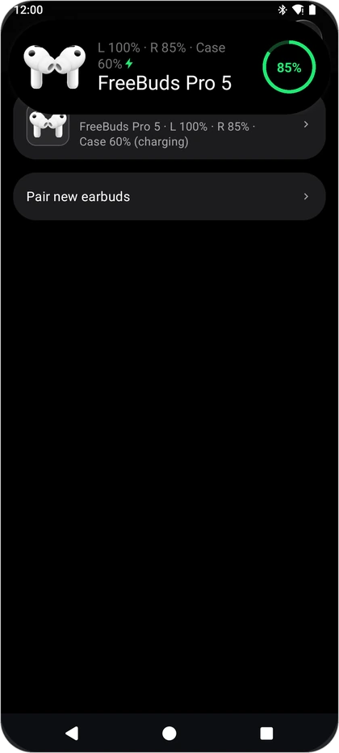
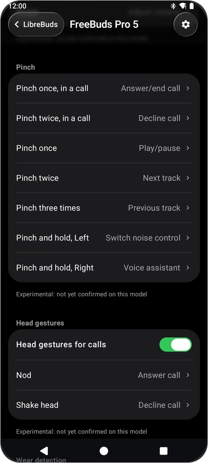
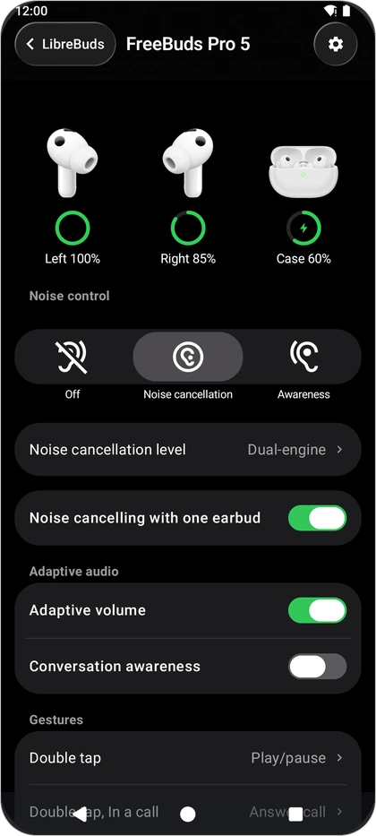

<div align="center">


# LibreBuds

**Open-source companion app for HUAWEI FreeBuds on Android.**<br />
Battery, noise control, gestures, equalizer and a popup when you open the case. No root, no vendor app.

<a href="https://github.com/librebuds/librebuds/releases"></a>
<a href="https://github.com/librebuds/librebuds/releases"></a>
<a href="LICENSE"></a>


<a href="https://github.com/librebuds/librebuds-windows"></a>

<br />

<a href="https://github.com/librebuds/librebuds/releases"><b>Download</b></a> ·
<a href="#features">Features</a> ·
<a href="#supported-models">Supported models</a> ·
<a href="#faq-and-troubleshooting">FAQ</a> ·
<a href="#building-from-source">Build</a>

</div>

<br />

<p align="center">
  
  
  
  
</p>
<p align="center">
  
  
  
  
</p>

> [!NOTE]
> LibreBuds is in early testing. Builds on the releases page are marked as pre-releases while
> the feature set settles. Bug reports with a diagnostics export are very welcome.

## Features

| Feature | Details |
| --- | --- |
| **Popup when the case opens** | A card that slides up with an animation of your model's case opening, or a compact island at the top of the screen. Shows left, right and case battery. |
| **Battery** | Separate levels for the left earbud, right earbud and case, with charging state. Also in a persistent notification, a home screen widget and the quick settings tile. |
| **Noise control** | Off, noise cancellation and awareness, with the levels your model offers (for example Dynamic, Cozy, General, Ultra or Dual-engine). |
| **Awareness modes** | Standard, voice mode and adaptive awareness, plus the awareness level where supported. |
| **Gestures** | Double tap, triple tap, touch and hold, swipe and the noise control cycle, per earbud and during calls. Pinch controls on stem models. Head gestures (nod, shake) to answer or decline calls. |
| **Equalizer** | Built-in presets and up to three custom presets with a 10-band editor. |
| **Find earbuds** | Play a sound on the left or right earbud. |
| **Sound** | Low latency mode, sound quality priority, pickup mode and voice prompt language. |
| **Multipoint** | Turn dual connection on or off, see the connected devices, pick the preferred one, connect or disconnect them. |
| **More settings** | Wear detection, single-earbud noise cancelling, adaptive volume, conversation awareness, ear tip type, drop detection, rest reminders and HD calls, depending on the model. |
| **Quick settings tile** | Battery at a glance and noise control from the notification shade. |
| **Widgets** | A battery widget and a noise control widget. |
| **Connection island** | A small island when the earbuds connect or move to another device, with an undo action. |
| **Material You** | Optional dynamic colours, light and dark theme. |

Which settings appear depends on what your earbuds report. Settings that have not yet been
confirmed on a given model are labelled *Experimental* in the app.

## Supported models

| Model | Status | Settings | Popup art |
| --- | --- | --- | --- |
| FreeBuds 5 | ✅ Tested on hardware | Full | Model animation |
| FreeBuds Pro 5 | ✅ Tested on hardware | Full | Model animation |
| FreeBuds 6 | 🟡 Expected to work | Full | Model animation |
| FreeBuds Pro 2 | 🟡 Expected to work | Full | Model animation |
| FreeBuds Pro 3 | 🟡 Expected to work | Full | Model animation |
| FreeBuds Pro 4 | 🟡 Expected to work | Full | Model animation |
| FreeBuds 4 | 🟡 Expected to work | Full | Model animation |
| FreeBuds 3 | 🟡 Expected to work | Battery, noise control | Model animation |

<details>
<summary><b>Other models with basic support</b> (battery and noise control, expected to work)</summary>

<br />

| Family | Models |
| --- | --- |
| FreeBuds | 3i, 4i, 4E, 4E (no ANC, battery only), 5i, 6i, 7, 7i, Pro, Pro 2+, Neo, Studio |
| FreeBuds SE | SE, SE 2, SE 4 ANC, SE 5 MAX |
| FreeBuds Lipstick | Lipstick, Lipstick 2 |
| FreeClip and FreeArc | FreeClip, FreeClip 2, FreeClip 2 (Collector's Edition), FreeArc |
| FreeLace | FreeLace, FreeLace Pro, FreeLace Pro 2 |
| Other | W Buds, W Buds 2, Eyewear, Eyewear 2 |

These models use a generic popup animation.

</details>

| Symbol | Meaning |
| --- | --- |
| ✅ | Tested with real earbuds |
| 🟡 | Supported in the app, not yet tested on this model. Reports welcome |

Tested on a model that is not marked ✅? Please [open an issue](https://github.com/librebuds/librebuds/issues)
with the result and a diagnostics export, so it can be marked.

## Download and install

1. Download the latest `librebuds-<version>.apk` from [GitHub Releases](https://github.com/librebuds/librebuds/releases).
   Release APKs are signed, so later versions install over earlier ones.
2. Open the APK on your phone and allow installs from your browser or file manager when asked.
3. Start LibreBuds and grant the permissions on the welcome screen.

Requires Android 13 or newer. LibreBuds is not on Google Play yet.

<details>
<summary><b>"Display over other apps" is greyed out or blocked</b></summary>

<br />

Android treats this permission as a *restricted setting* for apps installed from a file. Open
**App info** for LibreBuds, tap the **⋮** menu, choose **Allow restricted settings**, then grant
the permission again.

</details>

## Permissions

| Permission | Why |
| --- | --- |
| **Nearby devices** (Bluetooth connect and scan) | Talk to your paired earbuds, and notice when their case opens nearby for the popup. Declared as never used for location. |
| **Notifications** | Battery status and the background connection notice. |
| **Display over other apps** | Draw the popup card and the island over other apps. Without it, the popup shows as a notification. |
| **Companion device** (optional) | "Reliable background start" lets Android start LibreBuds when your earbuds connect, even after the system stopped the app. Android asks you to confirm. |

LibreBuds has no internet permission. It does not collect or send any data. Fonts are loaded
through Android's downloadable fonts service.

## Windows

The Windows app lives in a separate repository: [librebuds/librebuds-windows](https://github.com/librebuds/librebuds-windows),
a fork of [OpenFreebuds](https://github.com/melianmiko/OpenFreebuds).

## FAQ and troubleshooting

<details>
<summary><b>The popup does not show when I open the case</b></summary>

<br />

- Check that **Popup when the case opens** is on in LibreBuds settings.
- Grant **Nearby devices** and **Display over other apps** (see above for the restricted setting).
- Bluetooth must be on, and the earbuds must already be paired with the phone.
- The popup appears once per opening. Close the case for a few seconds before trying again.
- Use **Show test popup** in settings to check the popup itself works.

</details>

<details>
<summary><b>The popup shows as a notification instead of a card</b></summary>

<br />

LibreBuds falls back to a notification when it is not allowed to draw over other apps. Grant
**Display over other apps** in App info.

</details>

<details>
<summary><b>LibreBuds stops updating in the background</b></summary>

<br />

Some phones stop background apps aggressively. Open **App info → Battery** and choose
**Unrestricted**, and turn on **Reliable background start** in LibreBuds settings.

</details>

<details>
<summary><b>"Controlled by another device"</b></summary>

<br />

Another phone or computer is currently connected to the earbuds' control channel. Tap
**Take over** to control them from this phone.

</details>

<details>
<summary><b>A setting does not change or shows Experimental</b></summary>

<br />

*Experimental* means the setting is supported by the model but not yet confirmed with real
earbuds. If it does not work, please open an issue with a diagnostics export.

</details>

## Building from source

You need JDK 17 or newer and the Android SDK (compile SDK 37). No keystore is needed for debug
builds.

```bash
git clone https://github.com/librebuds/librebuds.git
cd librebuds/android
./gradlew :app:assembleDebug        # app/build/outputs/apk/debug/app-debug.apk
./gradlew test                      # unit tests
```

Release builds are signed only when `android/keystore.properties` (or the path in
`LIBREBUDS_KEYSTORE_PROPERTIES`) is present; otherwise `./gradlew :app:assembleRelease`
produces an unsigned APK.

Debug builds have a demo mode in settings that shows sample earbuds, useful for UI work without
hardware.

## Contributing

Bug reports, test results on new models and pull requests are welcome.

- When reporting a problem, attach a diagnostics export: **Settings → Share diagnostics** or
  **Save diagnostics to file**. The export leaves out serial numbers, host device names and full
  Bluetooth addresses.
- Mention your earbud model, firmware version (shown on the device screen) and phone.
- Before a pull request, run `./gradlew test` in `android/` and `python3 tools/check_ui_import.py`.

## Credits

- [LibrePods](https://github.com/librepods-org/librepods) (GPL-3.0): LibreBuds started as a
  remake of the LibrePods Android app. Its UI components, theme, island and popup window are
  imported and modified. No LibrePods media or fonts are included.
- [OpenFreebuds](https://github.com/melianmiko/OpenFreebuds): the base of
  [LibreBuds for Windows](https://github.com/librebuds/librebuds-windows).
- Material Symbols icons by Google (Apache License 2.0) and the Inter typeface (SIL Open Font
  License 1.1).

See [NOTICE](NOTICE) for details.

## License

LibreBuds is free software, licensed under the [GNU General Public License v3.0](LICENSE).

## Disclaimer

LibreBuds is an independent project. It is not affiliated with or endorsed by Huawei.
FreeBuds and HUAWEI are trademarks of Huawei Technologies Co., Ltd. Product names are used only
to identify compatible devices.
